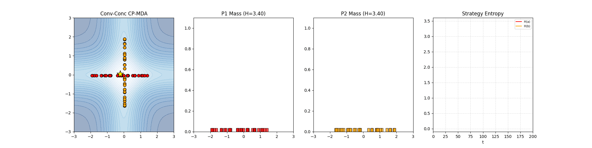
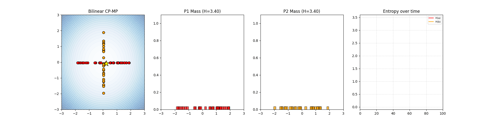

# Conic Particle Methods for Mixed Nash Equilibria

Synthesizing Chizat's WFR particle method with Shugart's negative-stepsize GDA to reliably find Mixed Nash Equilibria of continuous zero-sum games.

---

## Results

### CP-MDA (Mirror Descent-Ascent)

**Bilinear**


**Convex-Concave**


**SC-SC**


### CP-MP (Mirror Prox)

**Bilinear**


**Convex-Concave**


**SC-SC**


Each animation shows: **(left)** Hamiltonian landscape with weighted particle positions and barycenter trajectory; **(middle)** per-player probability mass histograms; **(right)** strategy entropy over time. Results are shown for three test games — bilinear, convex-concave, and SC-SC — each with its respective scheduler. Entropy decaying to 0 indicates correct mass collapse to the Nash equilibrium Dirac delta.
---

## Structure

```
├── cpmda_sling_fixed.py   # CP-MDA driver
├── cpmp_sling_fixed.py    # CP-MP driver
├── gifs/                  # Animation outputs
└── images/
    ├── cpmda_sling/       # Dashboard PNGs for CP-MDA
    └── cpmp_sling/        # Dashboard PNGs for CP-MP
```

## Key Ideas

- **WFR geometry**: weights updated via mirror descent (Fisher-Rao), positions via preconditioned gradient descent (Wasserstein). Position step divided by particle weight — heavy particles exploit, ghost particles explore.
- **Slingshot schedule**: periodically negative stepsizes break the GDA rotation cycle. To second order, paired $(h,-h)/(-h,h)$ steps emulate Hamiltonian Gradient Descent, which converges to the saddle.
- **CP-MP correction fix**: slingshot signs apply only to the prediction step; correction always uses $|\alpha|, |\beta|$.

## Dependencies

```
pip install numpy matplotlib
```

## References

- Chizat (2022). *An Exponentially Converging Particle Method for the Mixed Nash Equilibrium of Continuous Games.*
- Shugart (2024). *Negative Stepsizes Make Gradient-Descent-Ascent Converge.*
